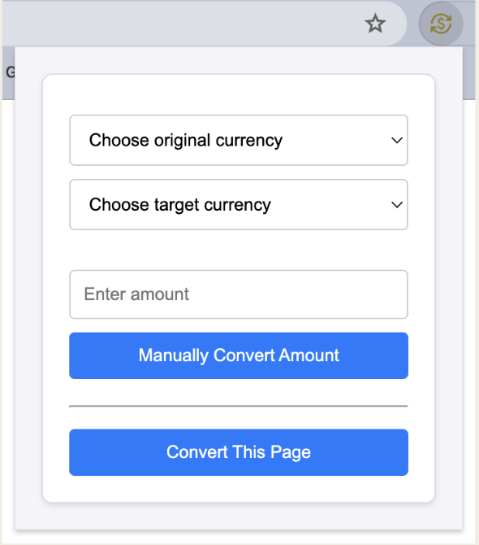
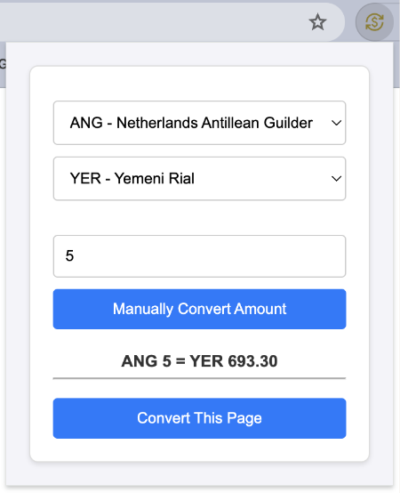
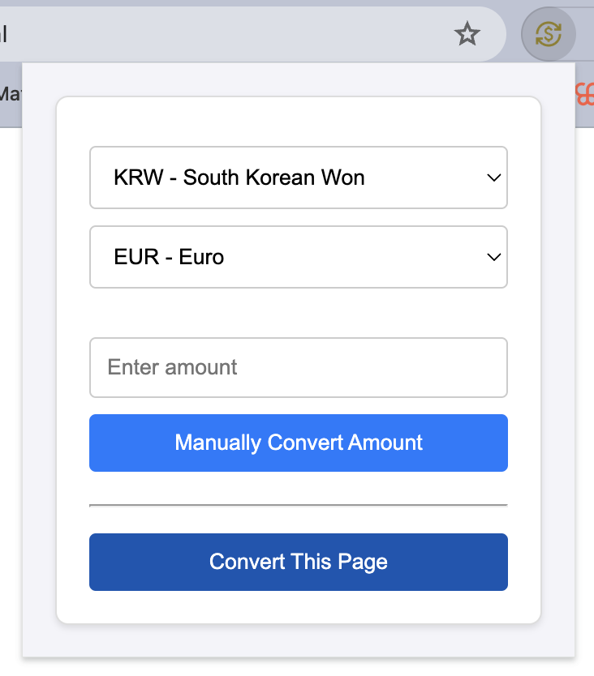
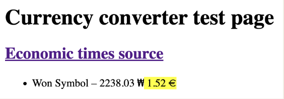
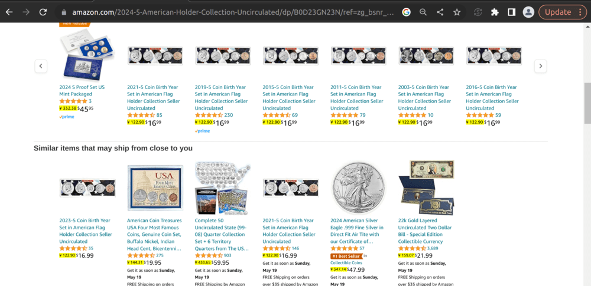

# Blog Post #1

In an era where online shopping is the standard for millions worldwide, we thought that creating a Google Chrome extension called Currency Converter would simplify the experience for many users. We planned to allow users to manually convert a specified amount based on their input or automatically convert the prices on the page with up-to-date foreign exchange rates with the click of a button. Our extension would allow users to quickly compare prices in their local currency before making purchases on websites that offer products in a different currency, easily budget on flights, accommodations, and activities while planning for future travels, efficiently price items in different currencies when selling products or service internations, and do many other useful tasks. In this blog post, we will describe the process as well as the decisions and mistakes that we encountered along the way. We had four main steps in our process: designing the UI/UX of the extension, connecting to our API, implementing the manual converter, and implementing the full page converter. 

Designing the UI/UX: When we first decided on our UI/UX, we used Figma to design the project interface and planned on using Material 3 to use components that would match each other. However, as we tried implementing, we hit a roadblock with Material 3 since we were unable to show the components in the extension despite many tries from multiple members. Instead of letting this be a major blocker, we opted for a simpler approach using basic HTML and CSS, especially since the practicality of our extension was more important than the design and we knew that for a simple extension like ours, it was probably better to stick to the basics. Now, with our project completed, we all believe that it was a good choice since we were still able to create a user-friendly extension that looked nice with simple HTML and CSS. 

Connecting to API: One of the key components of our Currency Converter extension was connecting to a reliable foreign exchange rates API. Initially, we selected an API that promised real-time updates at a relatively low cost. However, as we progressed, we faced a significant challenge: the API had a very low number of free requests per month, and our early testing phase quickly consumed these. This limitation prompted us to rethink our strategy. We switched to a different API that offered a higher number of free requests, but this brought another challenge. The new API provided rates primarily against the USD, requiring us to implement additional logic to handle conversions between non-USD currencies. To manage API calls efficiently and reduce loading times for users, we also introduced caching mechanisms. This allowed us to store previously fetched exchange rates and reuse them, decreasing the number of API requests needed and enhancing the overall user experience. This part of our project taught us to check third-party services carefully to make sure they meet all our needs without hidden restrictions and ensuring they align with the project's scale and scope. It also showed us the importance of being able to change our plans to adapt quickly and effectively when faced with new problems, with functionality front and center.

Implementing manual converter: Implementing the manual converter brought us one major problem. We realized that we couldn’t import the necessary API.js file into our popup.js script because there was a mismatch in the build setup. Without a tool like webpack to bundle our JavaScript files together, the browser couldn't find and load the API.js file when it was referenced in the popup.js script. However, once we figured out our mistake and installed webpack and configured it correctly, it handled all the heavy lifting of bundling our files, ensuring that everything was neatly packaged and accessible. Then, we were able to fully integrate the manual converter feature into our extension. 

Implementing the full page converter: Initially, we had decided to implement the extension such that all of the prices on the page would automatically be converted to the target currency when the user clicked a currency from the dropdown. However, we realized that it wouldn’t have been as user-friendly as adding a button so that the user could click to change the prices on the page instead of automatically changing the prices through the currency dropdowns. This is because we wanted our extension to have a manual converter as well as a full page converter.  We thought that we could simply move the logic for automatic conversion through the dropdown into a button, but it turned out to be a lot more complicated than we initially thought. However, after studying our code more and spending a few days trying to figure out the logic, we were finally able to allow automatic conversion from the click of a button in our extension, which finished the last main part of our project.

Now, after having implemented everything, we all agree that we are beyond satisfied with how our extension looks and works! Despite the mistakes that we encountered, we were able to solve them or find some way around them, which was great. We also learned many lessons through solving our blockers, such as figuring out that sometimes we need to start with the basics instead of overcomplicating things as well as learning how to adapt and change our initial plans if things don’t work out the way we expected. Our journey of creating Currency Converter has been a huge learning experience, and we are excited to use our project used in daily life. We included some pictures below to present our final project. To try the extension, click the "Get Started" button on the home page!

## Initial popup:

## Manual conversion: 

## Full page conversion 

### Example 1 (South Korean Won to Euros):

Result of converting from Korean Won to Euros:

## Example 2 (USD to Chinese Yuan): 

Amazon item

Amazon grid

Ebay

